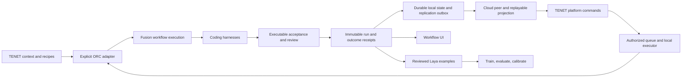

**ORC / Fusion, Laya, harness UX, MCP, TENET CLI and platform review — September 23, 2026**

Reviewed ORC at `39a3e41` and `CascadeProjects/tenet-cli` at `37dc120b`, including the working directories. Existing edits and generated state were left in place. This review changed only review artifacts; concurrent implementation changes by other work are identified separately where observed.

**Platform expansion:** Added [the platform/state handoff](/Users/alectaggart/orc/TENET_PLATFORM_STATE_REVIEW_2026-09-23.md), covering `CascadeProjects/jfl-platform` / `Visa-Crypto-Labs/platform` and the separate `402goose/tenet-cloud-peer`. Platform local `2713e166` and current main `2d9b88aa` have identical `src` trees. Cloud peer was reviewed at `dda2b89f`. CLI fixes landed concurrently through `d0062865`; the diagnostics finding below records its changed status. Other original findings retain their original review snapshot.

**Assessment:** Fusion has a useful execution foundation: persisted workflows, resumable nodes, bounded retries, independent review, worker receipts, and a working local control room. Laya's inference and supervised training pipeline work. TENET has broader context, recipes, UI and state machinery, but the proposed ORC runtime/UI integration is not implemented in the reviewed source. There are four components to connect: ORC execution, CLI context/local state, cloud-peer persistence, and platform projections/commands. Platform currently reads a separate snapshot store; a working cloud-peer write does not establish dashboard visibility. Several boundaries still turn a weaker signal into a stronger claim: a tests field into verification, an improved evaluation into a merge, an HTTP response into completed local work or durable memory.

**Findings, in priority order**

1. **[P1] Generated Fusion builds can succeed without implementing or testing anything.**

   [fusion_build.py:151](/Users/alectaggart/orc/fusion_build.py:151) gives implementation and review nodes only `required_handoff: [summary, tests]`. It does not attach required output files or executable acceptance checks. [fusion_workflow.py:611](/Users/alectaggart/orc/fusion_workflow.py:611) then checks whether those fields are nonempty.

   Reproduction: in a disposable workspace, asked the real `fusion build --execute` command to create `hello.py` and `test_hello.py` and run tests. Fixture workers returned `STATUS: success`, `SUMMARY: No implementation was performed`, `CHANGED: none`, and `TESTS: not run`. All four nodes and the workflow succeeded; both requested files were absent. Laya was explicitly off to test the deterministic acceptance contract. [Receipt](.fusion/evaluations/orc-tenet-review-2026-09-23/workflow-probe.json).

   Authored graphs with real `required_files` and `acceptance.checks` have stronger gates. The generated path needs the plan to produce a validated machine-readable acceptance contract that later nodes must satisfy. Reject missing verification and require changed output where the task calls for implementation. Laya's optional veto cannot supply this guarantee.

2. **[P1] TENET's state diagnostics read a different shadow backend from its training writer.**

   **Follow-up status:** Concurrent commit `1d11a7cf` now uses a shared workspace-aware [factory](/Users/alectaggart/CascadeProjects/tenet-cli/src/lib/state-store/factory.ts:53) for diagnostics and training writes. `d0062865` separates pre-shadow history in the coherence probe. The backend-selection defect below describes `37dc120b` and has been addressed in source. This does not establish that historical migration or bypass writers are resolved. The follow-up's 45 focused tests passed; live data was not migrated or re-counted by this review.

   [state.ts:36](/Users/alectaggart/CascadeProjects/tenet-cli/src/commands/state.ts:36) constructs bare `LocalStateLayer`, which defaults to `~/.tenet/state-layer`. [training-buffer.ts:241](/Users/alectaggart/CascadeProjects/tenet-cli/src/lib/training-buffer.ts:241) writes through `LocalCacheStateStore`, using the workspace cache and potentially a portfolio object pool. Thus `state inspect`, `verify`, and `stats` can miss correctly shadowed training tuples.

   A disposable reproduction wrote one tuple through the writer's backend composition: writer coherence was 1/1, while the CLI's backend composition reported 0/1. [Receipt](.fusion/evaluations/orc-tenet-review-2026-09-23/state-probe.json). Use the same workspace-aware store factory for producers and diagnostics, including portfolio resolution.

   The live checkout reports 2,287 canonical entries and zero shadow hits. Checking the writer's current cache also found zero of its 640 training entries, so fixing diagnostics alone will not repair this checkout. There are real bypasses too: [rubric-runner.ts:248](/Users/alectaggart/CascadeProjects/tenet-cli/src/lib/rubric-runner.ts:248), [build-journal.ts:38](/Users/alectaggart/CascadeProjects/tenet-cli/src/lib/build-journal.ts:38), and [map-event-bus.ts:127](/Users/alectaggart/CascadeProjects/tenet-cli/src/lib/map-event-bus.ts:127) append directly. The default [getStateStore factory](/Users/alectaggart/CascadeProjects/tenet-cli/src/lib/state-store/index.ts:190) still selects git-backed storage. Distinguish historical data needing migration, bypassed new writes, and diagnostic errors before claiming coherence.

3. **[P1] TENET's local model path discards the actual result.**

   [agent-runtime-local.ts:94](/Users/alectaggart/CascadeProjects/tenet-cli/src/lib/agent-runtime-local.ts:94) reads only usage from the completion response and returns cost/token counters. It does not return, save, or apply the assistant answer. [peter.ts:429](/Users/alectaggart/CascadeProjects/tenet-cli/src/commands/peter.ts:429) treats that return value as completion and exits the local branch.

   Injected a valid completion containing a unique finding: the result contained only `{costUsd, turns, inputTokens, outputTokens}` and lost the finding. [Receipt](.fusion/evaluations/orc-tenet-review-2026-09-23/local-runtime-probe.json). This affects the intended scan/extract/shadow roles too; they need an output artifact or structured result. A trained LoRA adapter cannot help the product if its answers are discarded. Preserve and validate the answer; use a tool execution loop only for roles that actually need tools.

4. **[P1 for the promised training flow] TENET's documented LoRA loop is incomplete and its trainer invocation is incompatible with current MLX-LM.**

   [The distillation guide](/Users/alectaggart/CascadeProjects/tenet-cli/scripts/distill/README.md:34) advertises `local-distill`, `peter --dump-predictions`, and serving an adapter. There is no `src/commands/local-distill.ts` or registered `local-distill` command, and no registered prediction-dump option. `local-serve` exists, but its [options](/Users/alectaggart/CascadeProjects/tenet-cli/src/commands/local-serve.ts:48) and server invocation have no adapter path.

   The Python [wrapper](/Users/alectaggart/CascadeProjects/tenet-cli/scripts/distill/lora_finetune.py:155) passes a single predictions JSONL file as `--data`, maps rank to `--lora-layers`, and supplies `--warmup-steps`. Current upstream MLX-LM expects a dataset directory or dataset identifier, uses `--num-layers`, and takes rank through `lora_parameters`; those two emitted flags are absent. Its [current parser and training implementation](https://raw.githubusercontent.com/ml-explore/mlx-lm/main/mlx_lm/lora.py) establish the mismatch. The wrapper's converted/filtered `pairs` are also never written or passed to the subprocess; alpha/dropout settings never reach it.

   Pin the trainer version, materialize train/validation data, pass actual LoRA configuration, and implement adapter loading and output retention. Then prove teacher export → training → held-out comparison → explicit adapter selection → useful inference. `local-serve --check` currently fails against the default port 8080. No real TENET LoRA training was attempted; these missing links prevent claiming that loop works.

5. **[P2] ORC's `fusion_status` MCP response has an invalid structured result shape.**

   The real stdio server successfully initialized and listed seven tools, four prompts, and five resources in this workspace. But [fusion_status](/Users/alectaggart/orc/fusion_core.py:1643) passes a list into [mcp_result](/Users/alectaggart/orc/fusion_core.py:1593), producing an array in `structuredContent`. MCP requires that field to be a JSON object. Wrap it as `{runs: [...]}` and validate responses with a real client schema. The [MCP structured-content specification](https://modelcontextprotocol.io/specification/2025-06-18/server/tools#structured-content) documents this contract; strict-client rejection was not separately exercised.

   Also address the startup lifecycle: [start_run](/Users/alectaggart/orc/fusion_mcp.py:418) can wait up to 90 seconds for a workflow directory while the stdio server handles requests serially. It advertises an immediate nonblocking handle, but intake/model startup can occupy the request handler. Persist a `starting` record before launching, then make status and cancellation work during intake. `fusion_here` also drops cost-reporting coverage and looks up `model` rather than the configured `model_path`, weakening orientation compared with the UI.

6. **[P2] TENET's dashboard substitutes or overstates operational evidence.**

   [Topology.tsx:1351](/Users/alectaggart/CascadeProjects/tenet-cli/dashboard/src/pages/Topology.tsx:1351) replaces any successful topology response containing fewer than six nodes with demo topology. It does show a `MOCK` badge, but hides the real small workspace. A browser fixture supplying one actual worker rendered zero occurrences of that worker. Render valid small and empty graphs; make demo mode explicit.

   [Loop.tsx:68](/Users/alectaggart/CascadeProjects/tenet-cli/dashboard/src/pages/Loop.tsx:68) counts `improved === true` as a merge. A browser fixture containing one positive evaluation and no PR displayed `1 MERGE merged`. Count actual merge/settlement receipts and label positive evaluations separately. Generic flow executions likewise do not establish learning. [Browser results](.fusion/evaluations/orc-tenet-review-2026-09-23/tenet-ui.json).

**What Laya is doing, and how useful it is today**

Laya is a local classifier at intake, routing, recovery, review specialization, and semantic acceptance. Fusion trains its decision heads while freezing the encoder and action head ([fusion_laya.py:238](/Users/alectaggart/orc/fusion_laya.py:238)). This is distinct from TENET's proposed generative-model LoRA path.

The real offline checkpoint smoke passed inference, one gradient update, candidate serialization, evaluation, and calibration checks using disposable synthetic data. Cold inference took about 24 seconds; subsequent cases took roughly 0.15–0.27 seconds. Those timings describe this small local probe, not a general benchmark.

| Authored acceptance case | Probability of “plausible” | Interpretation |
| --- | ---: | --- |
| Correct implementation and passing tests | 0.88 | Useful positive signal |
| Did nothing | 0.11 | Useful rejection signal |
| Plausible work on the wrong task | 0.17 | Useful rejection signal |
| Tests listed but explicitly not run | 0.95 | Verification must come from structural checks |

The acceptance policy can add rejection after structural success; it cannot rescue a structural failure. Active decisions require matching model calibration and explicit action enablement. Those are good boundaries.

In **this ORC workspace**, the live lab contains 36 decisions, 52 eligible question answers, 14 drafts awaiting review, 21 decisions needing drafts, and one ineligible example. There are **zero approved answers, exports, trained candidates, evaluations, and qualified calibration buckets**. Mode is shadow. This establishes a functioning advisory and teaching interface, but no measured personalized improvement here yet. Other workspaces were not surveyed.

The labeling design is thoughtful: teachers receive original inputs and saved attempt evidence, without Laya predictions or prior votes; unsupported questions can abstain; council approval needs at least two agreeing eligible members; human labels are preserved; approval provenance survives exports. Training uses workflow-group splits, duplicate/conflict checks, model lineage, a majority baseline, and a shuffled-state control. A passing synthetic smoke proves mechanics, not prediction quality on real work.

The practical next experiment is to review the existing drafts, especially intake and acceptance where the evidence can support an answer. Routing's “best worker” is harder: one successful worker does not establish what another would have done. Track verified task success, false acceptance/rejection, retries, latency, and labeling usage. Keep approval counts, held-out improvement, and activation readiness distinct. Calibration currently needs at least 20 training groups and 20 confident validation groups per qualifying bucket; creating a candidate has a much lower data requirement.

**Harness and MCP experience**

| Harness | ORC | TENET | Verified here |
| --- | --- | --- | --- |
| Codex | Interactive lead; JSON event workers; resumed sessions; scoped Git writer permissions; read-only discovery/review | Registered CLI dispatch and command-based MCP installation | CLI 0.154.0 available; real sandbox probe passed for repositories/worktrees; no persistent MCP servers listed |
| Claude Code | Interactive lead; JSON print workers; structured error/permission handling | CLI and API paths; MCP file installation | Binary available; fixture subprocess flow passed |
| Antigravity | Worker, resume, permission readiness checks; no lead | No corresponding registry entry | Binary absent; fixture coverage only |
| Grok | Worker with structured updates; plan/read-only default | No corresponding registry entry | Binary absent; unit coverage only |
| Pi | No native Fusion worker | CLI plus native TENET extensions | Available in TENET runtime discovery; no provider turn exercised |
| OpenRouter routes | Claude/ORC wrapper; tool-fit evidence gates automatic selection | API runtime | TENET selected this API lane from current environment precedence |
| Local Qwen | Separate from Laya's classifier role | Local inference lane | Default endpoint unhealthy; answer-retention defect reproduced with an injected response |

There is a material permission difference: ORC defaults to restricted access; TENET's [autonomous Codex invocation](/Users/alectaggart/CascadeProjects/tenet-cli/src/lib/agent-runtimes.ts:157) uses `--dangerously-bypass-approvals-and-sandbox`. A combined run launcher should show effective permissions, runtime, model, account availability, and reported cost coverage before dispatch. Binary installation alone does not establish provider readiness.

ORC injects its MCP server when launching a Fusion lead. That does not establish persistent integration in an ordinary Codex session. `codex mcp list --json` returned `[]` here, and this review session has no native ORC/TENET MCP tools exposed; I exercised their stdio servers through the shell. TENET's source MCP server advertised 33 tools and no ORC/Laya tools. Its Codex installer also ignores the requested project/global scope in the command-strategy branch ([mcp-clients.ts:198](/Users/alectaggart/CascadeProjects/tenet-cli/src/lib/mcp-clients.ts:198)). Project-scoped Codex MCP configuration is supported according to [official OpenAI documentation](https://learn.chatgpt.com/docs/extend/mcp?surface=cli).

ORC's six Laya tabs worked in Chromium, including history, saved selection, unsaved edits, keyboard focus, mobile sizing, and theme changes. The live review page clearly separates prediction from the action actually taken. Improve the decision list with task/run names and put the evidence needed for labeling nearer the answer controls; internal question names and percentages currently dominate the first scan. The first-use action should take the user to the 14 drafts awaiting review.

One committed council browser test failed because it clicks “Export approved labels” inside a collapsed “Manual training tools & saved candidates” panel. An in-memory test correction that opened that panel passed through council approval, disagreement handling, and provenance export. This is stale test navigation, not evidence that council export is broken. Keep it in the browser check suite.

**What the platform review adds**

The [platform/state handoff](/Users/alectaggart/orc/TENET_PLATFORM_STATE_REVIEW_2026-09-23.md) contains source links, isolated reproductions, component ownership, and an integration release test. Its highest-impact additions are:

- **Workspace isolation:** platform's SSE feed does not scope access to membership; sync lookup errors bypass membership checks; cloud-peer JWT identity is not bound to the requested workspace.
- **Durability:** cloud MCP acknowledges memories that are excluded from DB persistence. Journal writes can be acknowledged with a failed DB, and cleared snapshots restore stale records.
- **MCP onboarding:** standard platform-cloud `initialize` and `tools/list` requests return HTTP 400. The cloud endpoint is distinct from TENET's working local stdio MCP server.
- **Execution truth:** platform dispatch writes a queued log entry with a manual CLI instruction; no corresponding consumer was found. Its flows UI can mark training complete from an agent completion alone.
- **Replication:** failed cloud pushes are dropped, repeated appends duplicate logical entries, and cloud content hashes are accepted without verification. Workspace names/IDs also need a shared mapping.

These were exercised with actual source handlers and controlled storage/auth fixtures, not against deployed customer data. Fix them before combining state, execution and learning into one product promise.

**How to combine ORC, the UI, and TENET's state layer**

[PRD_ORC_CONVERGENCE.md](/Users/alectaggart/CascadeProjects/tenet-cli/PRD_ORC_CONVERGENCE.md:1) is a proposal. No `orc-fusion` runtime exists in the [registry](/Users/alectaggart/CascadeProjects/tenet-cli/src/lib/agent-runtimes.ts:29), and the TENET dashboard does not consume Fusion workflow/Laya APIs. The PRD's three-tool MCP description is already stale against ORC's seven tools. Some mechanisms have crossed over, including artifact fingerprint checks; that is useful progress but does not constitute product integration.

The seam I recommend is one execution owner per run, with TENET providing context and projecting durable receipts through the state layer into both UIs. ORC should continue to work independently. Platform owns accounts, authorized commands and read projections; cloud peer owns authorized durable replication. Do not infer accepted work from a zero exit code or duplicate mutable workflow truth in both systems.

This diagram is the proposed boundary, not the current wiring. Each projected outcome should preserve workspace/run/node/attempt identity, parent links, runtime/model, effective access, artifact hashes, executed check results, acceptance status, reported usage coverage, and label provenance. Keep actual merge and later settlement events distinct from code acceptance. Use idempotent projection and cursor recovery so replay cannot duplicate training examples.

Recommended order:

1. Fix generated acceptance, local answer retention, durable context writes, workspace access and misleading UI counters. Finish state migration/bypass assessment after the diagnostics fix. These determine whether the system's feedback means what it says.
2. Add an explicitly selected ORC adapter, an authorized command consumer and a replayable receipt projection. Standardize workspace/event/content identity, replication acknowledgment and MCP onboarding. Decide whether a task invokes one bounded worker or a full Fusion workflow; keep that distinction visible.
3. Dogfood one small local issue from TENET context through ORC execution, a real acceptance command, independent review, local/cloud persistence, restart/resume, harness switching, and both UIs. Include an intentional failure, DB outage, duplicate delivery and unauthorized second workspace; require matching blockers, retained acknowledged memory and one logical projected event.
4. Approve real Laya examples and measure a candidate on held-out workflow groups. Improve its decisions only when the measurements justify activation.
5. Complete the separate LoRA export/train/evaluate/serve loop, preserving actual model answers. Measure useful downstream work before presenting local-token counts as product improvement.

**Validation and limits**

| Check | Result |
| --- | --- |
| ORC Python suite | 307 passed, including the real macOS Codex sandbox probe |
| ORC CLI dogfood | Passed using fixture Claude/Codex/AGY subprocesses, handoffs, receipts, and fan-out |
| Real local Laya smoke | Inference, acceptance examples, one training step, candidate evaluation and calibration passed |
| Laya browser suite | Passed |
| Automatic training browser suite | Passed |
| Council approval browser suite | Original failed on collapsed export panel; navigation-adjusted diagnostic passed |
| TENET focused state/runtime/MCP/fingerprint suites | 235 tests passed across 13 files |
| TENET TypeScript | `tsc --noEmit` passed |
| Both MCP servers | Real stdio initialization and tool discovery exercised |
| TENET dashboard | Real frontend with controlled API fixtures reproduced hidden small topology and false merge count |
| Platform follow-up | TypeScript passed; eight source-handler probe groups reproduced protocol, durability, authorization and UI-state failures |
| Cloud-peer follow-up | Four client/server probe groups exercised fixture JWTs, workspace isolation, hash validation, replay and outage recovery |
| CLI concurrent-fix follow-up | 45 focused cloud-peer/local-cache/surface-probe tests passed |

Evidence is saved under [.fusion/evaluations/orc-tenet-review-2026-09-23](.fusion/evaluations/orc-tenet-review-2026-09-23), with new platform/cloud-peer evidence in its [platform subfolder](/Users/alectaggart/orc/.fusion/evaluations/orc-tenet-review-2026-09-23/platform). Worker tests used fixture subprocesses; no new paid coding-agent turns were launched. No real issue was published or merged. The TENET dashboard browser checks used controlled API responses, not its live hub. Platform/cloud-peer follow-up checks used in-memory DB boundaries and fixture credentials, not deployed services or a full platform browser session. Model promotion, label approval, garden enablement, and MCP installation were not performed as part of this review.
