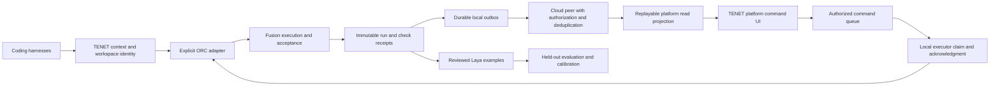

**TENET platform, state substrate, and harness integration — September 23, 2026**

Companion to the [ORC / Laya / CLI review](/Users/alectaggart/orc/ORC_TENET_REVIEW_2026-09-23.md). This adds the platform and cloud peer to the combined product assessment. No production implementation, deployment, auth configuration, or user data was changed.

**Assessment:** These components could give a coding harness persistent context, reliable execution, visible progress, and measured learning. The execution, storage, and dashboard boundaries are not connected well enough to promise that whole experience today. A saved memory can disappear, a queued action need not reach an executor, and a completed agent can be displayed as completed training. Establish durable, authorized, verifiable receipts before feeding these signals into Laya or LoRA.

**Where the components actually sit**

| Component | Location reviewed | Actual responsibility today |
| --- | --- | --- |
| ORC / Fusion / Laya | [/Users/alectaggart/orc](/Users/alectaggart/orc) | Harness execution, workflow attempts/recovery/review, local UI, decision labeling and supervised classifier training |
| TENET CLI | [/Users/alectaggart/CascadeProjects/tenet-cli](/Users/alectaggart/CascadeProjects/tenet-cli) | Context and recipes, runtimes, local dashboard, most of the state-store composition: git-backed streams, object/manifests, local cache, audit, policy, portfolio resolution, queues and cloud client |
| TENET platform | [/Users/alectaggart/CascadeProjects/jfl-platform](/Users/alectaggart/CascadeProjects/jfl-platform), canonical [Visa-Crypto-Labs/platform](https://github.com/Visa-Crypto-Labs/platform) | Next.js account/workspace UI, cloud context tools, workspace snapshots, dispatch log, webhooks and event feed |
| TENET cloud peer | [402goose/tenet-cloud-peer](https://github.com/402goose/tenet-cloud-peer); [reviewed source snapshot](/Users/alectaggart/orc/.fusion/evaluations/orc-tenet-review-2026-09-23/platform/tenet-cloud-peer) | Small Hono service storing objects and append-only streams in Postgres; separate from platform |

Platform local HEAD was `2713e166`; current GitHub main was `2d9b88aa`. I fetched an isolated copy and compared the entire `src` tree: identical. Platform findings therefore apply to both source snapshots. Dependency updates on remote main were not installed or separately validated. Cloud peer was reviewed at `dda2b89f`. It was not found in the searched CascadeProjects/code directories; the source snapshot above is for review, not a newly installed service.

CLI advanced during this review from `37dc120b` through `1d11a7cf` to `d0062865`. The shared [store factory](/Users/alectaggart/CascadeProjects/tenet-cli/src/lib/state-store/factory.ts:53) now connects diagnostics and the training writer, addressing the earlier backend-selection finding. A subsequent change separates pre-shadow history in the coherence probe. Those are concurrent changes, not patches made by this review. Historical migration and bypass writers remain separate questions.

**Findings**

1. **[P1] Workspace authorization is incomplete at both platform and substrate boundaries.**

   Platform's [event stream](/Users/alectaggart/CascadeProjects/jfl-platform/src/app/api/tenet/events/stream/route.ts:9) authenticates a user but never checks workspace membership. Supplying a workspace queries that workspace; omitting it queries all workspaces. A fixture authenticated as user A received the foreign-workspace sentinel in both cases, with zero membership checks. The stream is used by the Work Brain UI.

   Platform's [sync handler](/Users/alectaggart/CascadeProjects/jfl-platform/src/app/api/tenet/sync/route.ts:122) treats a failed workspace lookup as a new workspace. With a transient lookup failure and later writes succeeding, a nonmember bypassed the membership check, issued an Accountable (`A`) membership insert, wrote the snapshot, and received HTTP 200. Database errors must fail closed; workspace creation and first-owner assignment need an atomic operation that distinguishes creation from conflict.

   Cloud peer [verifies JWTs or a shared bearer](/Users/alectaggart/orc/.fusion/evaluations/orc-tenet-review-2026-09-23/platform/tenet-cloud-peer/src/index.ts:51), but takes workspace identity solely from the URL. JWT `sub` becomes an audit identity, not an access restriction. With real fixture-signed JWTs, user B wrote an object in workspace B and user A could read it; an unauthenticated request correctly returned 401. All state routes share this middleware. Bind a principal/capability to workspace and operation before querying storage. A shared bootstrap bearer must not be treated as per-user isolation.

   These are isolated reproductions against source handlers and mocked storage, not tests against deployed users or data. [Platform receipts](/Users/alectaggart/orc/.fusion/evaluations/orc-tenet-review-2026-09-23/platform/platform-probe.json), [cloud-peer receipts](/Users/alectaggart/orc/.fusion/evaluations/orc-tenet-review-2026-09-23/platform/cloud-peer-probe.json).

2. **[P1] Cloud “permanent memory” is volatile, and write acknowledgments do not establish persistence.**

   MCP [memory_add](/Users/alectaggart/CascadeProjects/jfl-platform/src/app/api/tenet/mcp/route.ts:504) calls `setWorkspaceData` and reports success. The [store](/Users/alectaggart/CascadeProjects/jfl-platform/src/lib/tenet/data-store.ts:109) explicitly excludes memories and links from DB persistence. Reproduction: HTTP 200 “Memory added,” one memory readable in the original process, zero persisted rows, then no workspace data after reloading the store with the same fixture DB.

   Journal/snapshot persistence also runs without being awaited; exceptions are swallowed. With the DB unavailable, `journal_write` still returned HTTP 200 “Journal entry written.” Moreover, empty arrays are not persisted: clearing an agent list returned an empty in-memory list, while reloading restored the old agent. The same stale rows can be rehydrated without a restart when the cache's nonempty-field condition is false.

   Store memory and journal entries durably as bounded records/objects. Return success after durable commit, or explicitly return a pending state backed by a durable outbox. Define absent-field versus empty-field semantics, deletion/tombstones, cache invalidation and concurrent append behavior. Whole-array snapshot replacement is not a safe authoritative multi-writer journal. [Reproduction](/Users/alectaggart/orc/.fusion/evaluations/orc-tenet-review-2026-09-23/platform/platform-probe.cjs).

3. **[P1 for harness onboarding] Platform's cloud MCP endpoint does not complete standard MCP initialization.**

   [POST](/Users/alectaggart/CascadeProjects/jfl-platform/src/app/api/tenet/mcp/route.ts:330) recognizes a custom `{tool, parameters}` body or `params.name`; it does not dispatch JSON-RPC lifecycle methods. Valid `initialize` and `tools/list` requests returned HTTP 400. A `tools/call` request reached the tool but its response omitted the request ID. GET sends unsolicited initialize/tools-list objects, without the endpoint event needed by legacy HTTP+SSE.

   This conflicts with the MCP [initialization lifecycle](https://modelcontextprotocol.io/specification/2025-06-18/basic/lifecycle) and [HTTP transport contract](https://modelcontextprotocol.io/specification/2025-06-18/basic/transports). The eight tool definitions and a custom HTTP caller do not establish compatibility with Codex, Claude Code, or other normal MCP clients. The checked-in benchmark uses that custom caller; its dry-run selector iterates the task's expected tool list, so it cannot establish independent model tool-selection accuracy either.

   The [settings snippet](/Users/alectaggart/CascadeProjects/jfl-platform/src/components/tenet/settings/mcp-config-snippet.tsx:11) also launches a fetch server command rather than configuring this endpoint's protocol/auth/workspace. Ship one supported transport with correct request IDs, initialization, errors, notifications and auth. Generate client-specific configuration and verify it with a real MCP client. The working CLI stdio server and ORC server are distinct products from this cloud endpoint; preserve that distinction in onboarding.

4. **[P2] Platform dispatch records intent, while the UI can imply execution or learning occurred.**

   [Build/eval dispatch](/Users/alectaggart/CascadeProjects/jfl-platform/src/app/api/tenet/dispatch/route.ts:10) inserts `status: queued` into `workspace_sync.dispatch_log`. The response tells the caller to run a CLI command manually. No consumer that claims and executes these rows was found in platform's `src`, `runner`, or `scripts`; the dashboard flows page reads them. Sync dispatch only updates workspace timestamps. The [live-runs list](/Users/alectaggart/CascadeProjects/jfl-platform/src/app/api/tenet/runs/route.ts:61) is always empty.

   Work Brain displays `message` and drops the returned manual `instruction`; it also substitutes “Dispatch sent.” when an error response has no message. DashboardHome discards the response entirely. Users cannot reliably distinguish an accepted request, a missing executor, and an actual running task.

   The [flows status derivation](/Users/alectaggart/CascadeProjects/jfl-platform/src/app/dashboard/[slug]/flows/page.tsx:49) marks mining, synthesis and strategy complete from one queued build entry. One agent with `status: complete` marks “Train policy” complete without a training receipt. “Issue filed” is complete even with no events. All three were reproduced by calling the actual derivation functions. These are workflow-shaped summaries, not execution graphs.

   Add a command record with a stable ID, authorized target workspace/machine, claim/lease, executor acknowledgment, heartbeat, cancellation and recovery. Until then, expose the manual instruction and describe the request as recorded. Derive completed steps, training, merges and sync freshness from their own receipts. A queued request must never count as a training example or reward.

5. **[P2] Cloud fan-out loses failed writes; adding retries alone would duplicate stream entries.**

   CLI's [CloudPeerStateStore](/Users/alectaggart/CascadeProjects/tenet-cli/src/lib/state-store/cloud-peer.ts:205) logs 5xx/network failures and drops that push. `flush()` waits for in-flight attempts; it does not retry or reconcile them. In the fixture, two local writes survived, but after a 503 and recovery only the second reached cloud, with no pending pushes. Reads remain local; this wrapper does not fetch missing remote state.

   Cloud peer [stream append](/Users/alectaggart/orc/.fusion/evaluations/orc-tenet-review-2026-09-23/platform/tenet-cloud-peer/src/state.ts:58) inserts a new sequence for every request. The schema has no uniqueness key for a logical event/delivery. Replaying the same append produced two entries with sequences 1 and 2.

   The CLI has a durable async queue implementation, but the inspected training factory directly wraps the audited cache with CloudPeerStateStore. Even wrapping a queue around the current client would not establish remote durability: the client resolves once local append succeeds and swallows cloud failure. Use a durable outbound record with explicit remote acknowledgment, stable event IDs and server deduplication. Measure pending, acknowledged and failed replication separately from local coherence. [Client/server probe](/Users/alectaggart/orc/.fusion/evaluations/orc-tenet-review-2026-09-23/platform/cloud-peer-probe.cjs).

6. **[P2] The cloud “content-addressed” boundary trusts the supplied hash.**

   Cloud [object/stream routes](/Users/alectaggart/orc/.fusion/evaluations/orc-tenet-review-2026-09-23/platform/tenet-cloud-peer/src/index.ts:100) check hash length only. They neither validate hexadecimal syntax nor recompute it from canonical content. A 64-character string of `z` was accepted as an object hash. The object insert uses `ON CONFLICT DO NOTHING`, so a conflicting payload is silently ignored rather than verified against its claimed identity.

   Reuse a versioned canonical hash contract across client/server and reject mismatches before acknowledging. Preserve event identity separately from content identity so retries can be deduplicated without suppressing two legitimate events with equal payloads. This matters before these objects become acceptance evidence, cross-harness context, or training provenance.

**What is connected today**

CLI `tenet sync` gathers snapshots and posts to platform `/api/tenet/sync`. Platform now has a real GET pull route as well. The current code supersedes STUBS.md's older one-way-sync description. The CLI push includes agents/evals/journal/scorecard/memories/links, but not the services/PR fields the server accepts; server defaults turn omitted fields into empty arrays in memory.

The separate cloud client posts stream/object writes to cloud peer when enabled. Platform's inspected workspace-state APIs query `workspace_sync` through its `DATABASE_URL`; I found no cloud-peer reader or receipt projector connecting them. [RAILWAY.md:35](/Users/alectaggart/CascadeProjects/jfl-platform/RAILWAY.md:35) says platform reads the sibling state-layer DB, but that connection is not present in the reviewed source. External deployment wiring was not inspected. The cloud peer's [delegation document](/Users/alectaggart/orc/.fusion/evaluations/orc-tenet-review-2026-09-23/platform/tenet-cloud-peer/docs/PLATFORM_DELEGATION.md) is a migration plan, not evidence that migration occurred.

Workspace identity also differs: CLI snapshot sync chooses `config.name` or directory basename, while [local-cache resolution](/Users/alectaggart/CascadeProjects/tenet-cli/src/lib/state-store/local-cache.ts:131) uses declared IDs, portfolio registration, or hashes of remote/path. The delegation sketch proposes `user-<id>`. These values need an explicit shared mapping before cloud streams can populate the right platform workspace. A rename must not create a new authority boundary.

The platform's generic `TenetServerStorage` SQL/vector adapter is a different interface from the CLI's append/list/get/put/watch StateStore. Similar naming does not make them one state layer. There is also no platform ORC adapter or Laya labeling/training projection in the paths reviewed.

**Proposed combined product contract**

Keep the four components independently usable, with one owner of execution per run:

| Owner | Responsibility | Required proof exposed to the user |
| --- | --- | --- |
| TENET CLI / local service | Resolve workspace and context, install/connect harness integrations, receive scoped commands | Canonical workspace ID, reachable executor, selected runtime/model and effective permissions |
| ORC / Fusion | Own workflow/node/attempt state, invoke harnesses, run acceptance/review, resume/cancel | Run handle immediately, task-linked logs/files, executed checks, precise blocked/accepted state |
| State substrate / cloud peer | Persist immutable evidence and context, enforce access, replicate and reconcile | Local commit vs cloud acknowledgment, cursor/backlog, replay-safe event and content IDs |
| TENET platform | Accounts and workspace membership, cross-machine command/status UI, read projections | Last receipt/cursor and freshness, claimed executor, real transitions and artifact links |

This is proposed wiring. Preserve workspace/run/node/attempt IDs, causal links, runtime/model and access, artifact hashes, actual check output, outcome status and cost coverage through the adapter. Keep `requested → claimed → running → verified/blocked → accepted` distinct from later `merged/settled`. Context updates need source/run identity and durable acknowledgment. No platform counter should manufacture one of these transitions.

For harness UX, show a compact capability/readiness card: binary available, authenticated provider, MCP connected, workspace resolved, executor reachable, storage acknowledged, and last verified result. Codex/Claude/other clients should see equivalent context and run IDs while retaining their actual permission and tool differences. Offer “open run,” “open artifact,” “copy path,” “resume,” and “cancel” against the same authoritative record on CLI and platform. Use client-specific installation snippets and a real initialize/list/call check, not a copied JSON snippet as evidence of connection.

Laya remains the bounded decision classifier inside ORC. Feed it original decision inputs and verified attempt evidence, then preserve independent labeling, approval and calibration. Do not convert dashboard heuristics, enqueue events, or successful HTTP requests into approved labels. TENET's generative LoRA path is separate: versioned dataset/adapter, held-out task evaluation, explicit adapter loading, retained model output, and downstream acceptance are still required. Shared provenance can support both without pretending they are the same learning loop.

**Order of work and release test**

1. Platform + substrate: close workspace-access gaps; make durable write acknowledgments and deletions honest; implement standard cloud MCP. These block trustworthy shared context.
2. State layer: agree on workspace/event/hash schemas, add replay-safe replication, migrate/reconcile historical data, then project into platform. Keep snapshot compatibility as a versioned projection while migrating.
3. Execution + UI: add the explicit ORC adapter and a real command consumer; replace inferred workflow/training states with receipts. Retain the original review's acceptance and local-answer-retention fixes.
4. Dogfood a disposable issue through context retrieval, dispatch, execution, executable acceptance, independent review, persistence and UI. Switch from one harness to another and recover the same durable context/run.
5. Repeat with an intentional test failure, executor restart, DB outage, duplicate delivery and unauthorized second workspace. Require: no false success; no lost acknowledged memory; eventual single logical event after reconnect; matching UI/CLI blocker and run identity; access denied outside the workspace. Only then evaluate learning improvements.

These are handoff work items, not changes made by the review. Avoid a repo merge or duplicate orchestration layer as the first integration step; the adapter and evidence contract make the components independently testable.

**Validation and limits**

| Check | Result |
| --- | --- |
| Local vs current platform main `src` comparison | Identical |
| Platform TypeScript | `tsc --noEmit --incremental false` passed using locally installed dependencies |
| Platform source-handler probes | Eight groups exercised MCP, memory/restart, empty snapshots, failed DB acknowledgment, dispatch, event scope, sync failure, flow derivation |
| Cloud-peer source/CLI probes | Four groups exercised real Hono routing + fixture JWTs, missing workspace authorization, invalid hash, duplicate append, 503/recovery |
| Focused CLI follow-up suites | 45 tests across cloud-peer, local-cache and surface-probe passed |

All new probes used in-memory database boundaries. They did not contact deployed platform/cloud-peer APIs, use real credentials, write to production Postgres, launch paid model calls, or exercise Railway deployment. Source handler/derivation checks are not a full platform browser session or a real PostgreSQL transaction/concurrency test. The original report contains the separate ORC/CLI/Laya browser and runtime checks.

Reproducible scripts, outputs, source snapshot and hashes are in the [platform evidence folder](/Users/alectaggart/orc/.fusion/evaluations/orc-tenet-review-2026-09-23/platform). Run the two `.cjs` probes from their saved location with the existing platform Node dependencies; they load actual TypeScript source while replacing only external boundaries. The CLI is actively changing, so results are pinned to the reviewed snapshots rather than a claim about future commits.
