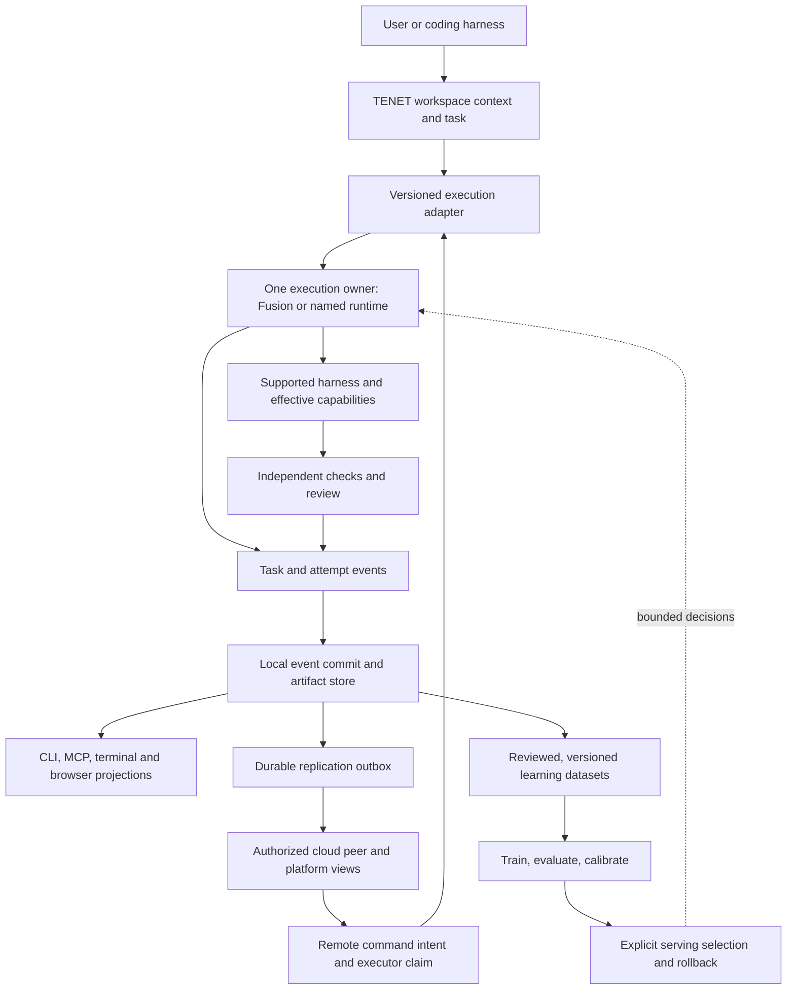

**TENET vNext: one coherent product, built and tested through Oasis**

Full architecture and product analysis, September 23, 2026. This expands the earlier review and dogfood plan. It combines independent state, learning/harness and platform investigations, a root investigation of evaluation quality, and an independent challenge of the proposed product scope. Observations below are distinguished from proposed decisions. This pass changes analysis and reproducibility artifacts, not product implementations or deployments.

**Recommendation**

Build the next TENET version around a durable, inspectable **task and its evidence**. A user should be able to choose a supported coding harness, give it a difficult task, see what is happening and why, inspect the actual result, survive interruptions, and continue from another session. Verified experience should then improve later work at an acceptable cost.

The next version needs an integrated execution, state and learning contract. Much of the implementation can be retained. ORC should be an explicit execution backend with its own useful workflow/review capabilities; TENET should provide persistent context, workspace/task coordination, evidence, product surfaces and measured learning. Keep one execution owner per run. Preserve local operation; make cloud sharing/remote execution additional capabilities with their own release gates.

Use Oasis to force this contract to work, starting with a small difficult slice and increasing its demands. Deliver Oasis improvements while completing the state migration incrementally. A new product promise does not require all repositories, stores, runtimes and renderers to become one implementation.

**Read this with the supporting investigations**

| Investigation | Deliverable |
| --- | --- |
| State, storage, identity, migration and durability | [State analysis](/Users/alectaggart/orc/TENET_VNEXT_STATE_ANALYSIS_2026-09-23.md) |
| ORC acceptance, harnesses, Laya, TENET policy and model serving | [Learning and harness analysis](/Users/alectaggart/orc/TENET_VNEXT_LEARNING_HARNESS_ANALYSIS_2026-09-23.md) |
| Local/cloud UI, terminal engines, memory APIs and onboarding | [Platform and UX analysis](/Users/alectaggart/orc/TENET_VNEXT_PLATFORM_UX_ANALYSIS_2026-09-23.md) |
| Grader integrity, experimental design and epistemic delegation | [Evaluation analysis](/Users/alectaggart/orc/TENET_VNEXT_EVALUATION_ANALYSIS_2026-09-23.md) |
| Initial Oasis milestones and session launch instructions | [Oasis dogfood plan](/Users/alectaggart/orc/OASIS_TENET_DOGFOOD_PLAN_2026-09-23.md) |

Primary probe revisions: CLI `b0ec9c4b`, ORC `1f21ac9`, platform local `2713e166`, sibling IDE `38ca096`; archived cloud peer `dda2b89f`. During synthesis, CLI advanced to `48820464` and ORC to `f1de13d`; the relevant source deltas are reflected below, while archived probe receipts retain their original scope. Earlier comparison found platform main `2d9b88aa` had an identical `src` tree. This pass did not verify production deployments. Repositories are being changed concurrently; record both source and installed/built artifact versions when implementing this plan.

**What the expanded analysis changed**

| Earlier premise or apparent capability | Current evidence | Consequence |
| --- | --- | --- |
| State diagnostics read the wrong cache | Shared factory fix has landed | Keep it; do not repeat that repair. Broader producer integration remains incomplete |
| All earlier direct-writer findings are still open | CLI `48820464` now routes classified outcomes, standard MAP persistence and recognized rubric-buffer paths through the shared factory | Keep this repair; inspect remaining writers and fallback/custom paths rather than duplicating it |
| A good coherence percentage proves migration | Probe reports 1/1 object hits with zero shadow stream entries | Check event membership, order, multiplicity, integrity and replay—not only blobs |
| Migration is safely repeatable | Running it twice duplicates the stream entry | Prove idempotent import before moving real history |
| Existing queue can simply be enabled | Two instances can overwrite the same persisted sequence file | Dormant implementation needs concurrency/restart proof before activation |
| A hand-written reference is behavioral ground truth | Actual reference rose from 2/13 to 13/13 with cosmetic edits and identical emitted JavaScript | Validate graders with actual execution and wrong-behavior controls |
| Baseline score parity means equivalent evaluation | Equal scores with unrelated failures produce `parity` | Keep as a diagnostic; do not use it alone for acceptance or training eligibility |
| Recorded training tuples are useful model supervision | Projection copies current reward into input features and drops synthetic provenance | Repair data lineage and feature timing before training/promotion |
| A locally trained policy is serving-compatible | Training/serving embedder and output meanings can differ | Version feature/embedding/action/output contracts and test full train→serve round trip |
| ORC's acceptance gap is completely resolved | No-change Git writes are rejected; new `f1de13d` also enforces files named in a valid plan contract. Generated verification commands remain reviewer instructions, not coordinator-executed checks | Keep both fixes; file production still does not establish the required behavior |
| Local dashboard needs cloud Postgres | Local browser reads Context Hub; terminal has local file readers | Retain the local product floor |
| No graph renderer exists | SVG/canvas graphs and terminal topology exist | Implement authoritative task/run projection, not another graph framework |
| All platform memory is volatile | Several separate DB-backed memory/journal APIs exist | Consolidate identity and authorization before reusing them |
| Unified search already unifies authorized memory | Actual handler with mocked auth/DB returns foreign team/snapshot records to A; query lacks the needed scope | Apply authorization to each source before merging retrieval results; separately verify deployed DB policy |
| IDE is a separate reusable package already consumed by CLI | CLI carries its own diverged workspace engine | Select maintained ownership and preserve useful differences before retiring duplicates |

These are reproducible/source-grounded distinctions, not reasons to discard the system. They identify where the next version must change semantics, where it only needs wiring, and where a capability is still experimental.

**Product scope and ownership**

| Layer | Owns | Does not establish by itself |
| --- | --- | --- |
| Workspace/context service | Canonical workspace identity, authorized context, task/requirement versions, reusable knowledge and source provenance | That remembered claims are true or instructions may override execution policy |
| Execution adapter | Runtime readiness, effective permissions, run handle, status/events, cancellation and supported resume mode | Task acceptance from process exit alone |
| ORC/Fusion or another named executor | Its run/node/attempt scheduling, bounded retries, harness invocation, artifacts and verification workflow | A second nested scheduler in TENET for the same attempts |
| State/evidence service | Event identity, immutable artifacts, commit/replication receipts, replay, corrections and projections | Correctness of the grader or usefulness of learned labels |
| Product surfaces | Task entry, current progress, evidence, attention/recovery, context and learning inspection | Independent mutable run truth in each screen |
| Learning services | Dataset eligibility/versioning, predictions, labeling, candidate training/evaluation and serving selection | Automatic improvement merely because traces exist |
| Cloud platform | Accounts/access, cross-machine views and authorized remote commands, optional shared context | Authority over a local run's execution state through snapshot heuristics |

This diagram describes the proposed contract, not current complete wiring. Keep services/modules together where convenient initially. Introduce a network or package boundary only when it serves a real consumer or deployment requirement.

TENET owns engineering task/run/evidence state. Oasis owns simulation state, persistent world edits, behavior activation and rollback. A TENET artifact reference can identify an Oasis checkpoint; that does not make the engineering event store the world database. Engineering policy, NPC policy and robotics policy may share artifact/provenance infrastructure while retaining separate episode formats, rewards, trainers and validation.

**1. The new state layer: precise guarantees before broad migration**

Keep distinct concepts that currently get conflated:

| Concept | Proposed contract |
| --- | --- |
| Workspace ID | Stable explicit ID; local path, remote URL, slug and legacy UUID are mapped aliases; portfolio membership is separate |
| Task / run / attempt | User requirement, chosen execution, and individual trial are separate identities; restarting a process does not erase them |
| Event ID | Identifies one logical occurrence; retries reuse it, repeated legitimate occurrences do not |
| Content hash | Identifies canonical immutable bytes under a versioned encoding contract; server verifies it |
| Commit acknowledgment | Names the achieved guarantee: queued, locally committed, remotely acknowledged, projected; disclose weaker modes |
| Projection cursor | Scoped to source/workspace/stream/generation; persisted with the derived view; never treated as a global clock |
| Execution claim | Names one owner and a generation/fencing token; expiry permits recovery, while guarded effects reject stale ownership; expiry alone does not stop a worker |
| Schema version | Known events project into typed views; unknown stored events survive verbatim; unsupported commands cannot execute |

Retain canonical hashes/blobs, legacy adapters, existing workspace/portfolio work and the shared factory. Repair the interfaces where current behavior cannot meet these contracts. CLI `48820464` now routes classified outcomes, standard MAP persistence and recognized rubric training-buffer paths through the shared dual-write factory. Outcome/rubric fallback writes and MAP custom paths remain direct; the separate BuildJournal writer, Context Hub journals, service events, Peter decisions, RL surface writer and memory mirror still need reconciliation. MAP still rewrites its persisted file on startup. This is meaningful migration progress, not proof of the storage guarantees above. The currently dormant `getStateStore()` factory is not the main production writer; wiring its selector alone will not migrate the product.

Use one bounded local-store conformance spike. **SQLite transactional event metadata/outbox with existing blobs retained is my preferred candidate** for multiple CLI/daemon/harness processes, given the existing dependency. Compare it with repairing the filesystem log behind one enforceable workspace writer. Do not declare either proven by the current probes. Require idempotency, atomic event/outbox intent, crash recovery, safe blob publication, concurrent writers, replay and correct projection before selection. There is no need to build another general storage framework.

Migrate by source occurrence, not payload hash alone. Inventory and copy originals; import with stable source IDs and a resumable ledger; run migration twice; verify counts, membership, order and corrupt/missing objects; compare old/new views at the same checkpoint. Cut over one supported stream/consumer at a time with a rollback/export path. Mark legacy evidence honestly: missing checks or run IDs must not be invented.

Portfolio enrollment and relocation must copy/verify referenced objects before switching the object root. Define retention, deletion/correction and compaction with checkpoint generations so histories can be bounded without silently invalidating cursors. Keep search/embeddings and UI snapshots as rebuildable views. Keep Oasis simulation ticks and bulk episodes in Oasis's own data path, with references/checkpoints in TENET.

**2. ORC and harness integration: a common run contract**

Choose whether TENET is asking for a bounded worker invocation or a full Fusion workflow. Name the execution owner in the run record. If Fusion owns a workflow, it owns the attempt retry policy and its node states; TENET can schedule portfolio-level tasks without separately retrying the same worker. All retry layers must consume an explicit total attempt/resource budget.

An adapter should expose capabilities and a small lifecycle: inspect readiness, start, observe, cancel, retrieve artifacts, and continue/recover where supported. Return a persisted run handle before slow model startup. Distinguish requested cancellation from confirmed termination and accounted-for side effects. Preserve underlying runtime outcomes rather than flattening unknown/refused/truncated into generic success or failure.

Fence effects as well as records. Isolate attempts in separate worktrees; require current ownership when accepting artifacts or publishing. After takeover, a stale worker must not be able to publish through the coordinator. An arbitrary shell command or external request can execute before its receipt is persisted: event deduplication does not make that effect exactly once. Record uncertain effects and reconcile them before retrying. Prefer downstream idempotency keys when the receiving system supports them.

The coordinator pins the acceptance bundle and evaluator version before dispatch, then runs those checks against the identified artifact. Keep this bundle outside candidate-controlled edits. Workers can propose test changes, but changing the acceptance contract is a separate recorded decision that invalidates the old comparison. Deterministic checks establish only their tested behavior; explicit domain or human review covers criteria that cannot yet be checked adequately.

For Codex, Claude, Pi and other discovered runtimes, readiness should reflect the whole chain: binary/version, authenticated provider, supported permission controls, project binding, MCP transport, output capture, resource limits, and last successful conformance run. A registry entry or installed executable is not proof that the whole path works. Keep provider-specific interactive features; expose unsupported capabilities clearly.

Cross-harness continuation should mean a fresh harness can reconstruct the task, constraints, accepted artifacts and prior failures from durable state. Native provider-session resume is a separate optional capability; do not promise that an opaque session identifier or hidden model state transfers across providers.

MCP should provide the same task/context/evidence contract through a compliant transport. Share tested tool semantics between local stdio and cloud HTTP adapters, not hand-maintained copies with different persistence. Keep the core task loop discoverable and use resources/links for large evidence. Generate configuration and recovery commands from actual supported registries, including scope. Fix the current cloud lifecycle before advertising it as standard MCP.

Use ORC's existing permission mechanisms where they fit, and expose TENET's effective settings. Full default host access must not silently follow a user who expected a restricted harness. Capability-scoped execution should improve incrementally around real subprocesses; the first release need not wait for a speculative universal WASM agent runtime.

**3. Learning: make the data trustworthy and the serving contract explicit**

The desired loop is observation → verified outcome → reviewed learning eligibility → candidate training → held-out evaluation → explicit serving selection → downstream measurement. Keep every stage inspectable. Collection, approval, training, evaluation, activation and real improvement are different events.

Immediate prerequisites from the current investigation:

- Remove target leakage: features describing the decision state must be available before the action/outcome. Current `recent_deltas=[current reward]` projection violates that boundary.
- Preserve `synthesized_outcome`, pending/settled status, producer and evaluator provenance through every conversion. Quarantine diagnostic/synthetic tuples from claims about real task success.
- Keep named features semantically meaningful. Hash-derived invented correctness/coverage/value metrics cannot stand in for observed measurements.
- Pin the embedder/tokenizer/feature schema/action vocabulary/output meaning with each model artifact. Prove training and serving use compatible representations.
- Separate action probability, expected reward, approval agreement and accepted-task success. The current v2 reward API can return action-class confidence; it cannot be compared as if it were an eval delta.
- Preserve local model answers and validate their useful output. Token accounting without the answer is not a completed local task.

Laya is the better-established bounded decision/labeling mechanism in the reviewed ORC path, with real candidate/evaluation/calibration machinery. Retain its evidence-backed review and abstention principles. Improve teacher diversity/provenance deliberately: different harness names do not prove independent models. Use executable outcomes for computable facts and reviewed judgment for ambiguous decisions; a voting result is not a substitute for an acceptance test.

TENET's policy head, reward buffers and RL surfaces should not simply be concatenated with Laya data. Define each question, pre-action inputs, available actions, measured target and deployment point. Reuse common lineage, dataset manifests, evaluation and serving registries while keeping different models/targets separate. Start with one low-consequence advisory use; compare against a simple baseline and a shuffled/ablated-input control. Keep routing labels counterfactual-aware: one successful worker does not establish the best alternative worker.

Use retrieval and reusable verified procedures before weight training when they address the problem. Repair the LoRA dataset→trainer→adapter-load→output-retention chain before using it. A later coding helper should have a narrow job, executable task trajectories, lineage-grouped splits, held-out task families, measured downstream utility and rollback. Oasis NPC and robotics policy learning need separate datasets/rewards and evaluation; engineering journals do not prove physical competence.

**4. A product users can understand**

Use one task detail/read model across the existing surfaces. Its first screen should answer: what was requested, what is running, what needs attention, what changed, what was checked, what is saved, and what can be done next. Keep advanced service topology, policy diagnostics and trace details available without making users interpret internal plumbing just to continue work.

Preserve the local terminal engine and browser dashboard. Consolidate their data meanings and actual Hub contracts, including the current flow-envelope mismatch. Reconcile the diverged sibling IDE after checking downstream callers and preserving CLI additions. Keep cloud Next and local browser frameworks if changing them has no measured product benefit.

For every task expose authoritative IDs, runtime/model and effective access, artifact/check links, actual blocker/outcome, last event/checkpoint and view freshness. On the originating machine offer open file, copy path and reveal directory; on another machine provide an authorized artifact download/reference with its hash. A cloud link must not pretend a laptop's absolute path exists remotely.

Replace inferred completion/merge/training counters with receipts. Display a valid small/empty workspace as itself, with an explicit optional demo mode. Make partial/unknown cost and offline/lagged state ordinary status values. Add an attention queue for blocked checks, human decisions, missing evidence and failed persistence.

Memory consolidation must preserve personal versus shared workspace visibility. Existing brain/team/journal stores are useful but have different identity and concurrency contracts. Apply membership/visibility restrictions independently inside every retrieval source before merging results. Close the reproduced unified-search, event-stream, sync-error and cloud-peer authorization gaps before using those paths for shared work.

**5. Build Oasis and TENET together without losing the project**

Start from the [Oasis research workspace](/Users/alectaggart/Oasis). The first proposed slice remains a tiny reproducible simulation, save/load, one versioned behavior change, a failed candidate rejected without losing the last working behavior, and a minimal viewer. Treat this as a provisional live-world-first choice; the user can choose a robotics-first task with similarly bounded acceptance.

Make the persistent edit explicit: a seed alone does not reconstruct subsequent user changes. Pin the build, inputs and state-equivalence rules for replay. Reproducibility does not establish physics fidelity or transfer to hardware. Begin behavior replacement through a bounded interface, with isolation where needed; defer arbitrary native DLL hot swapping until ABI compatibility, state migration and failure rollback have independent evidence. Preserving heap memory alone does not establish any of those guarantees.

Use existing TENET entry points and ORC execution where they work. If a missing adapter blocks the slice, implement the narrow integration rather than a second orchestrator. Maintain a stable runner and a separate candidate version. Keep one Oasis delivery board and one TENET improvement board linked by originating failures; there is one owner for each accepted task.

Each cycle should produce an accepted Oasis increment, retained attempt evidence, a short list of human interventions, and at most the bounded TENET repair required to unblock or materially improve the next attempt. Retain a documented manual escape so Oasis can progress when the tooling is broken; count that work as human-assisted. Timebox architectural detours against a visible project outcome.

Use three comparison conditions on frozen task snapshots: same harness/model with minimal orchestration, stable TENET, and candidate TENET. Keep starting code, acceptance and resource limits comparable; include failed attempts and repeat variable cases. Once a task informs a fix it becomes development/regression material. Keep fresh Oasis milestones and a few unrelated task families for transfer evaluation.

Freeze task selection and acceptance before each comparison, and record exclusions and manual rescues. Repeatedly selecting candidates against the same holdout turns it into development data; reserve a fresh final evaluation before a general improvement claim. These controls matter because TENET is simultaneously producing the work, collecting the evidence and proposing changes to itself.

Measure accepted tasks, human active minutes, elapsed time/cost including retries, false-success incidents, recovery/handoff reliability and durable evidence coverage. Your [cost-per-intent strategy](/Users/alectaggart/idiot-index-strategy.md) fits here: optimize total cost for verified outcomes. The cheapest successful configuration observed is an empirical reference, not a universal proven floor. Rebenchmark when models or workloads change.

**6. Cleanup tied to migration**

| Keep and strengthen | Consolidate during the pilot | Retire/archive only after replacement proves use |
| --- | --- | --- |
| Existing state objects/hashes, legacy formats and useful registries | One workspace resolver and one real producer composition per migrated stream | Dormant competing factories and obsolete phase-status docs |
| ORC execution, review, recovery and Laya lab | One run/attempt/outcome contract and adapter boundary | Duplicate retry/scheduling owners for the same run |
| Local Context Hub, MCP and retrieval | Common tested tool behavior and authorized query semantics | Cloud pseudo-MCP transport as an advertised standard server |
| Current local browser/terminal capabilities | Shared read models/status semantics; one maintained terminal engine | Diverged unused release paths, fake default data and inferred success widgets |
| Existing outcome/refusal concepts and historical records | Explicit compatibility mappings and provenance | Conflicting live schema definitions once all consumers use the mapping |
| Model/eval mechanisms with useful evidence | Versioned model/dataset/feature/output contracts | Synthetic-as-real metrics, leaked targets, stale trainer flags, discarded answers |
| Specs and journals explaining past decisions | A current capability inventory linked to producer/consumer probes | Stale setup commands, conflicting repo names and unqualified “built/complete” claims |

Import-count analysis identifies candidates for investigation, not automatic deletion. Check CLI registrations, dynamic imports, plugin entry points, shipped bundles and external consumers before retiring modules or repositories. Preserve history and provide migration notices/exports where users rely on formats. Avoid creating new package/repository boundaries before the pilot demonstrates actual shared consumers.

**7. Implementation sequence and release gates**

| Stage | Concrete deliverable | Exit proof |
| --- | --- | --- |
| A — Establish truth | Current capability map; pinned runner/build; behavioral acceptance for one Oasis task; remove/quarantine invalid learning inputs on this path | Cosmetic/no-op/wrong-behavior candidates fail; valid implementation passes; errors are unmeasured, not success |
| B — Connect one local task | Workspace binding, immediate run handle, explicit ORC adapter, required artifact/check receipts and first Oasis increment | Real supported CLI/MCP path delivers observable behavior; no silent bypass counted as TENET success |
| C — Recover it | Selected local commit implementation, event identity/outbox intent, claim/recovery and local task projection | Interrupt at commit/execution boundaries; retain acknowledged evidence; replay does not double-count or duplicate accepted commands |
| D — Make it portable | Second supported harness, consistent CLI/MCP/terminal/browser task view, one additional Oasis task | Fresh session continues the task with previous constraints/failures; all views report the same evidence and actual limits |
| E — Add shared/cloud operation | Scoped retrieval/commands, durable replication/pull, idempotent peer, standard cloud MCP, platform projection | Two-workspace isolation; outage/reconnect/replay; no lost acknowledged memory; visible projection lag |
| F — Learn measurably | One curated dataset/decision target, serving-compatible candidate and independent evaluation | No leakage/provenance loss; baseline/control comparison; held-out downstream improvement; explicit activation and rollback |
| G — Broaden and simplify | More task families; migrate remaining consumers; extract stable shared contracts; retire proven duplicates | Comparable task success maintained/improved with lower effort/cost; legacy rollback/export tested; old paths have no necessary consumers |

Stages are evidence gates, not promises that all existing features require sequential rewrites. Shared/cloud paths must remain gated until E, while local Oasis work can begin at B and continue through later stages. Useful retrieval/procedure improvements can happen before weight training. The canonical-store spike and acceptance work can run alongside narrowly scoped platform repairs, with explicit ownership to avoid conflicting changes.

**First release boundary.** Stage B is an internal dogfood preview. The first supported local release reaches D for a declared subset: one real Oasis increment, one named executor, durable task/artifact/check records, truthful rejection, process restart, and continuation from a second harness. CLI/MCP and the primary local task view must agree. It does not wait for every historical stream, all seven registry entries, every UI screen, cloud sharing, active learned routing or a coding LoRA. Publish support by capability and tested version:

| Capability level | Evidence required | User-facing promise |
| --- | --- | --- |
| Discovered/configured | Binary and registration inventory only | Available to configure; execution not yet verified |
| Bounded execution verified | Real fixture run, output/artifact capture, permissions and cancellation checked | Listed operations work under the recorded configuration |
| Task continuation verified | Interrupted real task recovered in a fresh session and second harness | Task evidence and constraints transfer; native provider-session state may not |
| Shared operation verified | Identity/isolation and outage/replay gates pass | Declared cloud/team features work under their tested scope |

These are per-adapter capability records, not one universal badge. The supported pair should include Codex because it is part of the intended daily workflow; choose the second from an installed runtime that passes conformance. Availability and actual paid/native-session behavior were not tested in this review.

**Stop and defer rules.** A fixture validates plumbing; a separate real Oasis task validates useful delivery. Apply these rules before broadening:

- Lost acknowledged evidence, duplicate command execution at the guarded boundary, conflicting task states or false acceptance blocks promotion. Probe interruption after command acceptance, artifact creation and final receipt before reply, then replay the same request and inspect from a fresh process.
- A cosmetic, missing, stale or wrong artifact accepted by a grader disqualifies that grader. Checker crash/timeout stays unmeasured. No training eligibility can repair a false acceptance upstream.
- Target leakage, erased provenance or training/serving disagreement blocks model promotion. Improvement confined to the originating task is a regression fix or task-specific procedure, not a general learned improvement.
- A behavior candidate that corrupts the last good Oasis state blocks that activation mechanism. Narrow the interface or isolate execution before adding native hot swapping or more complex worlds.
- Two consecutive cycles without an accepted Oasis increment trigger a scope review: freeze new infrastructure abstractions, reduce the next slice and use the recorded manual escape if needed. This is an operating heuristic to prevent endless platform work, not a statistical threshold.

**8. Remaining epistemic boundaries**

| Uncertainty | Smallest experiment | Decision it governs |
| --- | --- | --- |
| Which local commit implementation is sufficient? | Same crash/idempotency/concurrency suite on filesystem-writer and SQLite metadata/outbox candidates | Backend selection; no broad migration before result |
| Can generated acceptance measure this task family? | Known-good, baseline, cosmetic, partial and wrong-behavior candidates against frozen grader | Whether automated acceptance is eligible; otherwise require stronger checks/domain review |
| Can task context transfer across harnesses? | Stop one real harness and continue the same task in another from saved state | Supported continuation promise and required adapter information |
| Does ORC improve this workflow enough to justify overhead? | Comparable bounded tasks with fixed model/budget under minimal runner versus Fusion | Default workflow depth and when a direct worker is sufficient |
| Does learned routing beat a simple policy? | Shadow comparisons with available action set, pre-action features and controlled alternative runs | Advisory/active routing and exploration budget |
| Does a trained policy survive the serving boundary? | Train tiny fixture model, load exactly its embedder/schema, replay same inputs and compare outputs | Artifact registry and promotion eligibility |
| Are store/server checkpoints safe under concurrent commits? | Disposable real DB/multi-process tests with delayed commit/ack and restart | Replication cursor, deduplication and transaction design |
| Do identities remain stable across real workspace operations? | Move/rename/worktree, SSH/HTTPS remote spelling, portfolio join/leave and legacy UUID/slug import | Resolver and migration policy |
| Does cloud storage enforce the intended audience? | Two-principal/two-workspace route matrix over every search/store/event path | Shared-workspace release |
| Are Oasis domain claims true? | Separate measured simulation/replay/performance tasks and later physical-transfer validation | Engine/robotics scope; do not infer from coding success |
| Does TENET improve beyond Oasis? | Held-out tasks from unrelated repositories and languages | General product claims and model promotion |
| Is cleanup removing real capability? | Entry-point/consumer inventory plus parity checks and rollback rehearsal | Deprecation rather than deletion by filename/import count |

Give delegated investigations these bounded questions, the cost of being wrong, source/evidence scope, and a stopping criterion. Require observation/inference/recommendation to be labeled. Preserve unresolved disagreements and their evidence. Current file-touch coverage is a useful activity map, not epistemic confidence; the next version should track claims with revision-scoped evidence and invalidate them when dependencies change.

**Validation boundary**

The investigations used actual source, isolated filesystem/handler/model-response fixtures, existing focused test suites, and archived cloud-peer source. They exposed several failures despite passing existing tests. These results establish concrete implementation/contract defects and inform the proposed design. They do not prove a deployed combined product, real model improvement, safe multi-machine failover, PostgreSQL commit-order behavior or Oasis engine/robotics viability. No paid coding/training campaign, production mutation, deployment or repository consolidation was performed.

The immediate implementation target is the smallest trustworthy Oasis build loop: one task, one named execution owner, one durable evidence trail, a real check of the result, and recovery visible through the product. Expand that working loop until the larger TENET promise is supported by repeated evidence.
